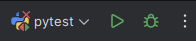
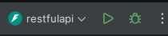
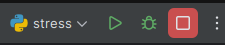

# RESTfulAPI

An API implementation with FastAPI.

### Notes

It took me about 8 hours to complete the requirements,
and another 12 doing the bonus and extras.

#### Challenges

I ran into a couple challenges while creating this application,
mostly centered around the usage of MongoDB as the database backend:

* I needed to mock a testing harness to allow unit tests of the MongoDB functions, 
  which turned out to be a bit more work than anticipated. 
* If the application has multiple instances such as the Kubernetes DaemonSet 
  you can see in `deployment/kubernetes.yaml` along with load balancing, 
  then atomic updates are no longer guaranteed in MongoDB. 
  * I fixed this by adding a retry loop with stochastic delays for
    `update_record()` in `app/mongo.py`. 
  * You can test this for yourself
    by running the stress test against my homelab instance, instructions
    below in the [Extras](#extras) section.

### Usage

* Install dependencies:
  * [Docker Desktop](https://www.docker.com/products/docker-desktop/)
  * [PyCharm](https://www.jetbrains.com/pycharm/)
  * [Docker Compose](https://docs.docker.com/compose/install/)
  * Instead of PyCharm, this will also work with Docker Engine on Linux
    and running shell commands/scripts
* Development
  * Clone the repo: `git clone git@github.com:roryl23/RESTfulAPI.git`
  * Set up a virtualenv however you like
    * [pyenv](https://github.com/pyenv/pyenv?tab=readme-ov-file#installation): 
      `pyenv install 3.13.2 && pyenv virtualenv 3.13.2 restfulapi && pyenv activate restfulapi && pip install -r requirements.txt`
  * Open PyCharm to the repo directory, or change to repo directory in the shell
  * Activate your virtualenv
  * Run the tests
    * In PyCharm, select the pytest run configuration:

      

    * From the shell, run `pytest`
  * Run the application
    * In PyCharm, select the restfulapi run configuration: 

      
    * From the shell, run `docker compose --file deployment/docker-compose.yaml up`
    * Application is up:
      * [API Documentation](http://localhost:8080/docs#/)
      * [Jaeger](http://localhost:16686/)
      * [Prometheus](http://localhost:9090/)
* Production
  * Install Kubernetes
    * In Docker Desktop, just go to settings and enable the Kubernetes cluster
  * Install [Tilt](https://docs.tilt.dev/)
  * From the shell, run `tilt up`
  * Application is up:
    * [API Documentation](http://localhost:8010/docs#/)
    * [Jaeger](http://localhost:16686/)
    * [Prometheus](http://localhost:9090/)

### Extras

* Publicly available at:
  * [API Documentation](http://roryl23.ddns.net/docs)
  * [Jaeger](http://roryl23.ddns.net:16686/)
  * [Prometheus](http://roryl23.ddns.net:9090/graph?g0.expr=http_request_duration_milliseconds_bucket&g0.tab=0&g0.display_mode=lines&g0.show_exemplars=0&g0.range_input=5m)
* To make the Prometheus metrics more interesting, run the stress test:
      
  
  * From the shell, run `python scripts/stress.py --host roryl23.ddns.net --port 80`
  * Note that the stress test is only meaningful when run against
    a deployment with multiple instances with load balancing.
